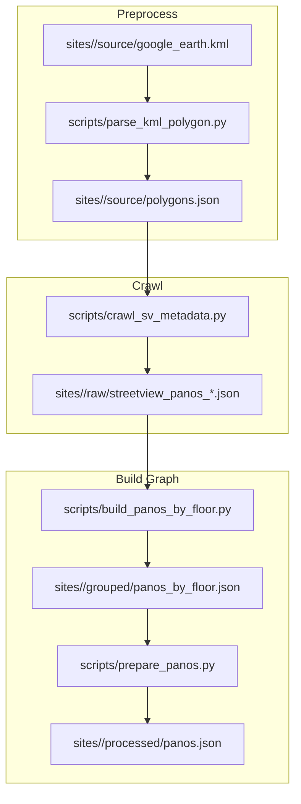

# Street View Pano Pipeline

這個工作區將 Google Street View metadata 轉成可直接給導航系統使用的 graph。

## Directory Layout

```text
dataset/google_streetview/pano_graph/
  README.md
  scripts/
    parse_kml_polygon.py
    crawl_sv_metadata.py
    build_panos_by_floor.py
    prepare_panos.py
  sites/
    british_museum/
      source/
        google_earth.kml
        polygons.json
      raw/
        streetview_panos_*.json
      grouped/
        panos_by_floor.json
      processed/
        panos.json
```

## Pipeline



## 檔案角色

- `scripts/parse_kml_polygon.py`: 將 Google Earth 匯出的 KML 轉成 `polygons.json`
- `scripts/crawl_sv_metadata.py`: 在 polygon 範圍內爬 Street View metadata
- `scripts/build_panos_by_floor.py`: 將多份原始爬取檔依樓層合成 `panos_by_floor.json`
- `scripts/prepare_panos.py`: 將樓層分組資料轉成最終 `panos.json`

## 資料契約

### `sites/<site>/raw/streetview_panos_*.json`

原始爬取輸出，包含：

- `seed`
- `search_radius_m`
- `max_nodes`
- `polygon_outer`
- `panos`

其中 `panos` 內的節點欄位通常為：

- `pano`
- `lat`
- `lng`
- `imageDate`
- `links`
- `inside_polygon`
- `dist_m_from_seed`

### `sites/<site>/grouped/panos_by_floor.json`

以樓層為 key 的中繼檔：

```json
{
  "0": {
    "<panoID>": {
      "panoID": "...",
      "lat": 0,
      "lng": 0,
      "imageDate": "...",
      "links": [{"panoID": "..."}]
    }
  },
  "-1": {}
}
```

說明：

- `scripts/crawl_sv_metadata.py` 本身不會推斷樓層
- 樓層是從 `raw` 檔名推斷後，再由 `scripts/build_panos_by_floor.py` 分組
- 目前檔名規則：
  - `0` -> `0`
  - `05` -> `0.5`
  - `b1` -> `-1`
  - `b2` -> `-2`

### `sites/<site>/processed/panos.json`

最終導航 graph，格式為：

```json
{
  "<panoID>": {
    "panoID": "...",
    "lat": 0,
    "lng": 0,
    "links": [{"panoID": "...", "heading": 0, "description": null}],
    "floor": "0"
  }
}
```

這份資料具備：

- 單層 `panoID -> node` 結構
- 樓層資訊已攤平到每個節點
- 缺少的反向邊已補齊

## 建議使用方式

### 1. 從 KML 產生 polygon

```bash
python3 dataset/google_streetview/pano_graph/scripts/parse_kml_polygon.py \
  --input-path dataset/google_streetview/pano_graph/sites/british_museum/source/google_earth.kml \
  --output-path dataset/google_streetview/pano_graph/sites/british_museum/source/polygons.json
```

### 2. 依樓層或區域重複執行爬蟲

```bash
python3 dataset/google_streetview/pano_graph/scripts/crawl_sv_metadata.py \
  --polygons-json-path dataset/google_streetview/pano_graph/sites/british_museum/source/polygons.json \
  --placemark-name "british museum" \
  --seed-lat 51.5192548 \
  --seed-lng -0.1280553 \
  --output-path dataset/google_streetview/pano_graph/sites/british_museum/raw/streetview_panos_0_1.json
```

### 3. 合成 `panos_by_floor.json`

```bash
python3 dataset/google_streetview/pano_graph/scripts/build_panos_by_floor.py \
  --input-dir dataset/google_streetview/pano_graph/sites/british_museum/raw \
  --output-path dataset/google_streetview/pano_graph/sites/british_museum/grouped/panos_by_floor.json
```

### 4. 產生最終 `panos.json`

```bash
python3 dataset/google_streetview/pano_graph/scripts/prepare_panos.py \
  --input-path dataset/google_streetview/pano_graph/sites/british_museum/grouped/panos_by_floor.json \
  --output-path dataset/google_streetview/pano_graph/sites/british_museum/processed/panos.json
```
